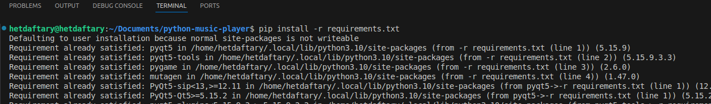

# PYTHON-MUSIC-PLAYER

* A simple easy to use music player made in python using PyQt5, pygame and mutagen


## Running the project

### Ubuntu or another Debian base distro 

* Install pip for python3

```bash
sudo apt install -y python3-pip
```

* Go to the folder of music player and install the requirements of the project

```bash
pip install -r requirements.txt
```



* Run the project 

```
python3 src/main.py
```

## App features 

* Current look


* Select and use play selected to play song of choice or play in normal way using play button.
* Can edit meta data by just editing in the application.
* Currently, I have not added the feature to add/remove any song to the application but it can be simply done by adding or removing mp3 files from "data/mp3-files" folder.

## TODO 

| Task | Status |
|------|--------|
| To implement to store and use sqlite database for meta data and comments | Done |
| To implement a feature that shows which song is currently being played by the player | Done |
| To add a feature for adding or deleting a song | Done |
| To implement the other menu requirements like playing a song not in library in close button | Done |
| Drag and drop feature to implement add songs | Done |
| Song name should be above buttons and keep buttons in bottom widget center aligned only | started |
| Make table ui pretty | not started |
| Implement the right click functionality to add/delete songs | not started |