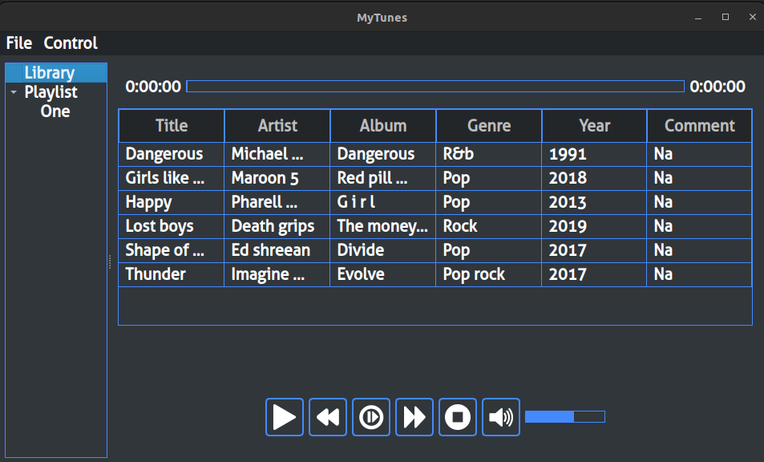

# PYTHON-MUSIC-PLAYER

* A simple easy to use music player made in python using PyQt6, pygame and mutagen

## Running the project

### Ubuntu or another Debian base distro

* Install pip for python3

```bash
sudo apt install -y python3-pip
```

* Go to the folder of music player and install the requirements of the project

```bash
pip install -r requirements.txt
```


* Run the project

```bash
python3 src/main.py
```

## App features

* Current look



* Playlist opened in new window


* Select and use play selected to play song of choice or play in normal way using play button.
* Can edit comments of a song in the application.
* Currently, I have not added the feature to add/remove any song to the application but it can be simply done by adding or removing mp3 files from "data/mp3-files" folder.
* We can make our own playilst and delete them if required.
* Songs can be added to the library or playlist by using context menu or drag and drop
  * In the library section, context menu shows 3 entries and in the playlist it only shows 2
  * We can add any to any playilst write from the library using the context menu
* Any song added to the playlist will also be added to the library
* We can add a song multiple times to the playlist but not to the library
* We can open a playlist in a new window using context menu in the tree widget
  * We can also drag and drop songs from library to playlist to add songs
* We can play a song using song history in the control menu in the context menu
